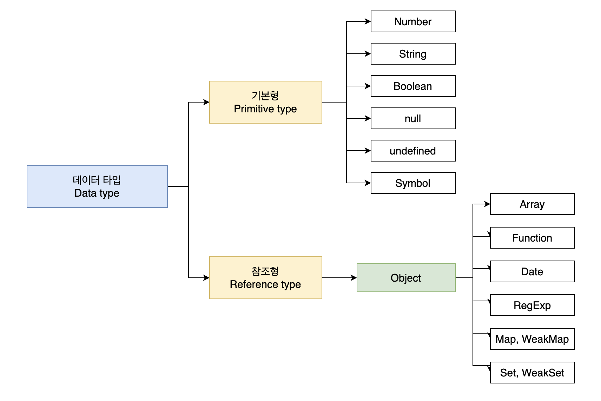
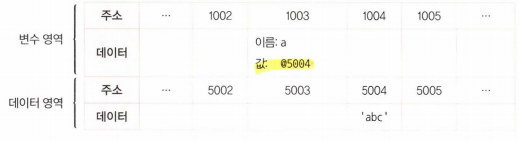

# [1장] 데이터 타입

## 1. 데이터 타입의 종류



**📍기본형**

- 기본형 데이터를 변수에 할당하면 값 자체가 변수에 복제된다. 변수와 값 사이에 직접적인 관계를 갖지 않고, 값이 변경되어도 다른 변수에는 영향을 주지 않는다. (불변값)
- 숫자, 문자열, 불리언, null, undefined, Symbol

**📍참조형**

- 값이 담긴 주솟값들로 이루어진 묶음을 가리키는 주솟값을 복제 (가변값)
- 참조형 데이터를 변수에 할당하면 값이 담긴 메모리 주소(참조)가 변수에 복제된다.
- 배열, 객체, 함수

## 2. 데이터 타입에 관한 배경지식

과거에는 메모리 용량이 제한적이었기 때문에 작은 크기의 정수형 타입(short 등)을 사용하여 메모리를 절약했다. 하지만 특정 범위를 벗어나는 값이 입력되면 오류가 발생하거나 잘못된 값이 저장되는 문제가 있었다. 이를 해결하기 위해 사용자가 직접 형변환을 해야 했다.

현대의 자바스크립트와 같은 프로그래밍 언어는 메모리 용량이 훨씬 커졌기 때문에 이러한 메모리 제약이 크게 줄었다. 숫자형 데이터의 크기에 대한 걱정이 덜해졌고, 대부분의 경우에는 64비트, 즉 **8바이트**를 사용하여 숫자를 저장한다. 그래서 형변환이나 메모리 제약과 같은 문제를 걱정할 필요가 없어졌다.

> 모든 데이터는 바이트 단위의 식별자 (메모리 주솟값)을 통해 서로 구분하고 연결할 수 있다.

**📍식별자와 변수**

- 변수: 변할 수 있는 수(변경 가능한 데이터가 담길 수 있는 공간)
- 식별자: 어떤 데이터를 식별하는 데 사용하는 이름 (변수명)

## 3. 변수 선언과 데이터 할당

```jsx
var a = 'abc'
```



```jsx
var obj1 = {
  a: 1,
  b: 'bbb',
}
```


- 참조형은 객체의 변수 영역이 별도로 존재한다. 객체가 별도로 할애한 영역은 변수 영역일 뿐 데이터 영역은 기존의 공간의 메모리 공간을 그대로 활용하고 있다.
- 변수에는 다른 값을 얼마든지 대입할 수 있기 때문에 참조형은 가변값이라고 하는 것

> 📍**변수 영역과 데이터 영역을 분리하는 이유**

- **구조화된 메모리 관리:** 프로그램의 변수와 데이터를 각각의 목적에 맞게 분리하여 메모리를 효율적으로 관리할 수 있다.
- **변수와 데이터의 독립성 유지:** 변수와 데이터가 분리되면 변수에 대한 수정이 데이터에 영향을 미치지 않으며, 데이터의 변경이 변수에 영향을 주지 않는다.

> 🤔5라는 값이 담긴 변수를 100개 선언해야 한다면 <br>
> 변수가 선언된 메모리 영역에 직접 값을 할당하는 경우 100개 모두 메모리에 있어야함
> 하지만, 데이터 영역을 분리해 주소값만 변수영역의 값에 할당되면 100개의 변수는 5라는 값이 담긴 하나의 주소값만 참조하기 때문에 메로리 효율이 증가한다.

## 4. 기본형 데이터와 참조형 데이터

📍**불변값**

- 값이 생성된 후에 변경할 수 없는 특성
- 새로운 값을 할당하면 이전 값은 변하지 않고 메모리에 새로운 공간에 저장된다.
- 데이터 영역에 저장된 값은 모두 불변값

```jsx
var name = '보'
name = name + '미'
```

변수name에 문자열 '보' 를 할당했다가 뒤에 '미'를 추가하면 기존의 '보'가 '보미'로 바뀌는 것이 아니라 새로운 문자열 '보미'를 만들어 그 주소를 변수에 저장한다.

- '보'와 '보미'는 완전히 별개의 데이터!
- 주소가 다르다고 생각하자.

> 변수영역에 name이 생기고, 데이터 영역의 (예를 들어) 5003에 보가 저장되어있는 것이고, 나중에 보미라는 문자열이 5004에 저장되는 것. 그래서 변수영역의 값이 5003에서 5004로 바뀐다는 뜻.

📍**가변값**

- 값이 생성된 후에 변경할 수 있는 특성
- 참조형 데이터는 같은 메모리 주소를 공유하는 다른 변수나 객체에 영향을 줄 수 있다.

```jsx
var person = { name: '보미' }
person.name = '보라' // 객체 내의 속성 값 변경 가능
```

**📍변수 복사 비교**

기본형)

```jsx
// 기본형 데이터 (원시형)
let num1 = 10 // 숫자
let str1 = 'Hello' // 문자열

// 변수에 복사된 값 확인
let copiedNum1 = num1
let copiedStr1 = str1

// 변수의 값 변경
num1 = 20
str1 = 'World'

// 변수의 값과 복제된 값 출력
console.log(num1) // 20
console.log(copiedNum1) // 10
console.log(str1) // "World"
console.log(copiedStr1) // "Hello"
```

참조형)

```jsx
// 참조형 데이터 (객체형)
let obj1 = { name: 'John', age: 30 } // 객체
let arr1 = [1, 2, 3, 4, 5] // 배열

// 변수에 복사된 값 확인
let copiedObj1 = obj1
let copiedArr1 = arr1

// 변수의 값 변경
obj1.name = 'Jane'
arr1.push(6)

// 변수의 값과 복제된 값 출력
console.log(obj1) // { name: "Jane", age: 30 }
console.log(copiedObj1) // { name: "Jane", age: 30 }
console.log(arr1) // [1, 2, 3, 4, 5, 6]
console.log(copiedArr1) // [1, 2, 3, 4, 5, 6]
```

## 5. 불변 객체

❓불변 객체가 왜 필요할까

값으로 전달받은 객체에 변경을 가하더라도 원본 객체는 변하지 않아야 하는 경우가 있다.

```jsx
// 가변성으로 인한 문제점
const obj1 = { value: 10 }
const obj2 = obj1

obj1.value = 20

console.log(obj2.value) // 출력 결과: 20
```

**💡불변 객체 만드는 간단한 방법**

```jsx
const obj1 = { value: 10 }

// 객체의 프로퍼티를 복사하여 새로운 객체 생성
const obj2 = { ...obj1 }

obj1.value = 20

console.log(obj2.value) // 출력 결과: 1
```

**📍얕은 복사 (Shallow Copy)**

- 객체의 최상위 레벨만을 복사하고 내부 객체는 참조로 복사하는 방식
- 바로 아래 단계의 값만 복사한다.
- 프로퍼티 값이 객체일 경우에는 해당 객체를 참조로 복사한다. (복사된 객체와 원본 객체가 같은 객체를 참조)
- 복사된 객체의 프로퍼티 값이 변경되면, 원본 객체의 프로퍼티 값도 변경될 수 있다.
- Object.assign()이나 Spread 연산자(...)이나 copyObject

```jsx
// 얕은 복사 예시

// 원본 객체
const originalObj = {
  name: '보미',
  age: 25,
  address: {
    city: '서울',
    country: '대한민국',
  },
}

// 얕은 복사
const shallowCopyObj = { ...originalObj }

// 원본 객체와 얕은 복사된 객체의 주소 확인
console.log(originalObj === shallowCopyObj) // false

// 내부 객체의 주소 확인
// 내부 객체인 address는 얕은 복사되어 참조로 복사되었기 때문에 동일한 메모리 주소를 가짐
console.log(originalObj.address === shallowCopyObj.address) // true

// 내부 객체 변경
originalObj.address.city = '제주도'

// 얕은 복사된 객체의 내부 객체도 변경되었는지 확인
// originalObj의 address 객체를 변경 -> shallowCopyObj.address도 같은 객체를 참조하고 있기 때문에 shallowCopyObj 객체에서 address 객체의 변화가 반영됨
console.log(shallowCopyObj.address.city) // 제주도
```

**📍깊은 복사 (Deep Copy)**

- 원본 객체의 모든 프로퍼티들을 재귀적으로 복사하여 완전히 새로운 객체를 생성한다.
- 새로운 객체와 원본 객체는 완전히 독립적이며, 서로 다른 메모리 공간을 참조한다.
- 복사된 객체의 프로퍼티 값이 변경되어도, 원본 객체의 프로퍼티 값은 영향을 받지 않는다.
- JSON.stringify()와 JSON.parse()

```jsx
// 원본 객체
const originalObj = {
  name: '보미',
  age: 25,
  address: {
    city: '서울',
    country: '대한민국',
  },
}

// 깊은 복사
const deepCopyObj = JSON.parse(JSON.stringify(originalObj))

// 원본 객체와 깊은 복사된 객체의 주소 확인
console.log(originalObj === deepCopyObj) // false

// 내부 객체의 주소 확인
console.log(originalObj.address === deepCopyObj.address) // false

// 내부 객체 변경
originalObj.address.city = '제주도'

// 깊은 복사된 객체의 내부 객체가 변경되었는지 확인
console.log(deepCopyObj.address.city) // 서울
```

- 깊은 복사를 사용하면 내부 객체의 변경이 원본 객체나 다른 복사된 객체에 영향을 주지 않는다.
- 깊은 복사는 JSON 문자열을 중간에 생성하므로 일부 데이터 타입이나 함수 등을 복사할 수 없는 한계가 있다.

## 6. undefined와 null

**📍undefined**

- **값을 대입하지 않은 변수, 즉 데이터 영역의 메모리 주소를 지정하지 않은 식별자에 접근 할 때**
- **객체 내부의 존재하지 않는 프로퍼티에 접근하려고 할 때**
- **return문이 없거나 호출되지 않는 함수의 실행 결과**
- 자바스크립트 엔진이 자동으로 부여하는 값으로, 직접 할당하는 경우도 있지만 보통은 변수가 초기화되지 않았을 때 발생한다.

**📍null**

- null은 의도적으로 "값이 없음"을 나타내는 데 사용된다.
- 변수에 의도적으로 값이 없음을 할당하거나, 객체의 프로퍼티를 삭제할 때 주로 사용된다.
- null은 객체가 존재하지 않음을 나타내는 것이 아니라, 객체가 있는데 그 값이 없음을 나타낸다.

```jsx
// 변수 선언만 하고 초기화되지 않은 경우
let undefinedVariable
let nullVariable = null

// 값이 없음을 나타내는 변수에 대한 비교
console.log(undefinedVariable === undefined) // true
console.log(nullVariable === null) // true

// undefined와 null 비교
// 서로 다른 데이터 타입이므로 === 비교 연산자를 사용하여 비교할 때 false 반환
console.log(undefined === null) // false
```
