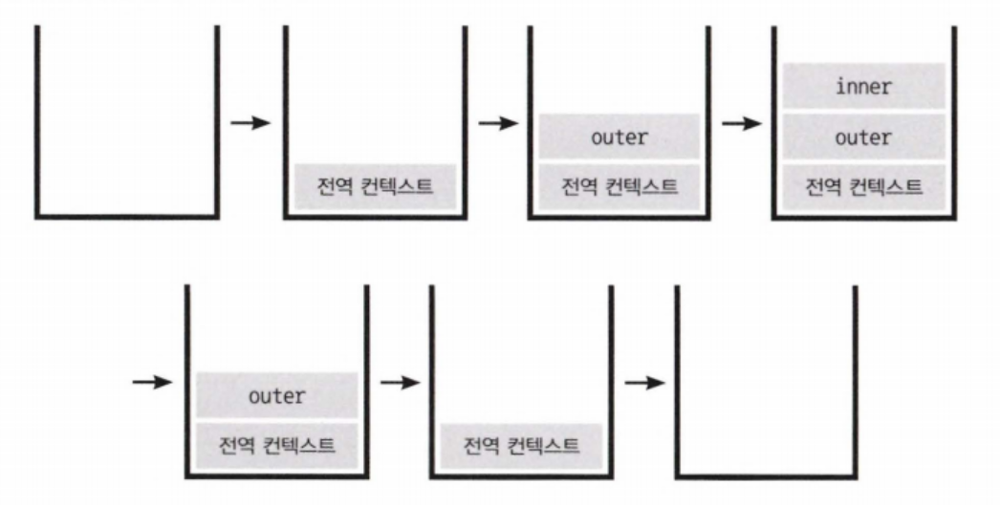
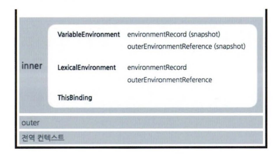

# [2장] 실행 컨텍스트

## 1. 실행컨텍스트란?

> 스택: 후입선출 <br>
> 큐: 선입선출

- 실행할 코드에 제공할 환경 정보들을 모아놓은 객체
- 동일 환경에 있는 코드들을 실행할 때 필요한 환경 정보들을 모아 컨텍스트를 구성하고, 이를 콜 스택(call stack)에 쌓아올렸다가, 가장 위에 쌓여있는 컨텍스트와 관련 있는 코드들을 실행한다.
- 실행 컨텍스트를 구성하는 방법: **함수를 실행하는 것**



```jsx
function outer() {
  const outerVar = 'Outer'

  function inner() {
    const innerVar = 'Inner'
    console.log(innerVar) // Inner
    console.log(outerVar) // Outer
    console.log(globalVar) // Global
  }

  inner()
}

const globalVar = 'Global'
outer()
```

1. 전역 컨텍스트: 전역 변수 `globalVar`이 설정
2. `outer` 함수 호출: `outer` 함수의 실행 컨텍스트가 쌓이고, `outerVar`가 설정
3. `inner` 함수 호출: `inner` 함수의 실행 컨텍스트가 쌓이고, `innerVar`가 설정
4. `console.log` 호출: `innerVar`, `outerVar`, `globalVar`에 접근해 값을 출력

> **❓전역컨텍스트**
>
> - 자바스크립트 코드 실행의 시작점이 되는 실행 컨텍스트
> - 브라우저에서는 window 객체가, Node.js에서는 global 객체가 전역 컨텍스트임.

실행컨텍스트가 활성화될 때 자바스크립트 엔진은 해당 컨텍스트에 관련된 코드들을 실행하는 데 필요한 환경 정보들을 수집해서 실행 컨텍스트에 저장한다.

- **VariableEnvironment**: 현재 컨텍스트 내의 식별자들에 대한 정보 + 외부 환경 정보선언시점의 LexicalEnvironment의 스냅샷으로, 변경사항은 반영되지 않음.
- **LexicalEnvironment**: 처음에는 VariableEnvironment와 같지만 변경사항이 실시간으로 반영됨
- **ThisBinding**: this 식별자가 바라봐야 할 대상 객체.

> 실행 컨텍스트는 두 가지 주요 구성 요소인 Lexical Environment와 Variable Environment로 이루어져 있다.
>
> 

## 2. VariableEnvironment

> VariableEnvironment 에 담기는 내용은 LexicalEnvironment와 같지만, 최초 실행 시의 스냅샷을 유지한다는 점이 다르다.

실행 컨텍스트를 처음 생성할 때 VariableEnvironment에 정보를 먼저 담고, 이를 그대로 복사해서 LexicalEnvironment를 만들고, 이후에는 LexicalEnvironment를 주로 활용한다. 내부는 environmentRecord와 outer-EnvironmentReference로 구성되어있다.

>

- VariableEnvironment는 **변수 선언(var, let, const)과 관련된 정보**를 저장한다.
- 변수 선언 시 VariableEnvironment에 해당 변수의 정보가 저장된다.
- VariableEnvironment는 environmentRecord와 outer 속성으로 구성된다.

## 3. LexicalEnvironment

- 코드의 구문 구조와 관련된 정보를 저장한다.
- **함수 선언, 변수 선언** 등 코드의 구조적 정보가 LexicalEnvironment에 저장된다.
- 변수와 함수의 스코프 정보를 관리한다.

### 📍environmentRecord와 호이스팅

- environmentRecord에는 현재 컨텍스트와 관련된 코드의 식별자 정보들이 저장된다.
- 컨텍스트 내부 전체를 처음부터 끝까지 쭉 훑어나가며 순서대로 수집한다.
- 실행 컨텍스트가 코드를 실행하기 전에 이미 변수 정보를 모두 수집한다. <br>
  즉, 코드 실행 전에도 자바스크립트 엔진은 이미 해당 환경에 속한 코드의 변수명들을 모두 알고있다. → 호이스팅
  > ❓**호이스팅** <br>
  >
  > - 변수와 함수 선언이 코드 실행 전에 메모리 공간에 할당되는 현상
  > - **변수 선언의 경우, var 키워드로 선언된 변수는 undefined로 초기화되지만, let과 const 키워드로 선언된 변수는 초기화되지 않는다.**
  > - 함수 선언의 경우, 함수 전체가 메모리에 할당되지만, 함수 표현식은 호이스팅되지 않는다.
  >   **변수 호이스팅**
  >
  > ```jsx
  > function a(x) {
  >   console.log(x) //------------ (1)
  >   var x
  >   console.log(x) //------------ (2)
  >   var x = 2
  >   console.log(x) //------------ (3)
  > }
  >
  > a(1)
  > ```
  >
  > ```
  > 1
  > undefined
  > 2
  > ```
  >
  > 를 예상했지만?
  > 실제 결과는?
  >
  > ```
  > 1
  > 1
  > 2
  > ```
  >
  > ```jsx
  > function a(x) {
  >   var x // 수집 대상 1의 변수 선언 부분
  >   var x // 수집 대상 2의 변수 선언 부분
  >   var x // 수집 대상 3의 변수 선언 부분
  >
  >   x = 1 // 수집 대상 1의 할당 부분
  >   console.log(x) //------------ (1)
  >   console.log(x) //------------ (2)
  >   x = 2 // 수집 대상 2의 할당 부분
  >   console.log(x) //------------ (3)
  > }
  >
  > a(1)
  > ```
  >
  > 호이스팅을 할 때 변수는 선언부와 할당부를 나누어 ‘선언부'만 끌어올린다!!

### 📍함수 선언문과 함수 표현식

**✨함수선언문**

- function 정의부만 존재하고 별도의 할당 명령이 없는 것
- 함수명이 반드시 정의되어 있어야 함

```jsx
function sayHello() {
  console.log('Hello!')
}
```

**✨함수표현식**

- 정의한 function을 별도의 변수에 할당하는 것
- 함수명 없어도 됨

```jsx
const greet = function () {
  console.log('Hi!')
}
```

> **✨기명 함수표현식**: 함수명 정의한 것
>
> ```jsx
> const greetWithName = function greet() {
>   console.log('Hello with Name!')
> }
> ```
>
> **✨익명 함수표현식**: 함수명 정의 안 한 것

### ❓함수 선언문과 함수 표현식의 호이스팅 차이

**✨함수 선언문**

- 호이스팅의 영향을 받는다.
- 변수 선언과 함께 함수 전체가 호이스팅되어 함수를 선언하기 전에도 호출할 수 있다.

```jsx
console.log(a()) // Output: "Hello, world!"

function a() {
  return 'Hello, world!'
}
```

**✨함수 표현식**

- 호이스팅의 영향을 받지 않는다.
- 변수 선언만 호이스팅되고, 함수 할당은 호이스팅되지 않는다.
- 함수 표현식을 사용하는 경우 함수를 선언하기 전에는 호출할 수 없다.

```jsx
console.log(a()) // TypeError: a is not a function

var a = function () {
  return 'Hello, world!'
}
```

### 📍스코프, 스코프 체인, outerEnvironmentReference

**✨스코프**

- 식별자(변수, 함수)에 대한 유효범위
- ES5 까지의 자바스크립트는 전역 공간을 제외하면, 오직 함수에 의해서만 스코프가 생성된다.

**✨스코프의 종류**

**✏️전역 스코프(Global Scope)**

- 전역 변수: 전역 공간에서 선언한 변수(어디서든 접근할 수 있는 변수)
- 전역 함수: 어디서든 호출할 수 있는 함수
  > 전역 스코프는 피하는 것이 좋다. 변수 충돌, 메모리 누수 등의 문제가 발생할 수 있다.

```jsx
var globalVar = 'Hello, global!'

function globalFunc() {
  console.log(globalVar) // 'Hello, global!'
}

globalFunc()
```

**✏️지역 스코프(Local Scope)**

- 지역 변수: 함수 내부에서 선언한 변수
- 함수 스코프: 함수 내부에서만 유효한 변수와 함수
- 블록 스코프: { } 내부에서만 유효한 변수와 함수 (ES6 let, const 도입)
  > 지역 스코프를 사용하면 변수 충돌을 방지하고 메모리 관리를 효율적으로 할 수 있다.

```
function localFunc() {
  var localVar = 'Hello, local!';
  console.log(localVar); // 'Hello, local!'
}

localFunc();
console.log(localVar); // ReferenceError: localVar is not defined
```

**✏️렉시컬 스코프(Lexical Scope)**

- 함수가 정의된 위치에 따라 결정되는 스코프
- 함수 내부에서 외부 변수에 접근할 수 있다.

```jsx
var x = 5

function outer() {
  var x = 10
  function inner() {
    console.log(x) // 10
  }
  inner()
}

outer()
console.log(x) // 5
```

inner() 함수는 outer() 함수 내부에 정의되어 있기 때문에, inner() 함수 내부의 x는 outer() 함수의 지역 변수 x를 참조한다.

**✨스코프 체인**

- 변수와 함수를 찾는 과정에서 스코프가 중첩되어 계층적으로 구성된 구조
- 식별자의 유효범위를 안에서부터 바깥으로 차례로 검색해나가는 것 → outerEnvironmentReference가 함

```jsx
var x = 5 // 전역 스코프

function outer() {
  var x = 10 // outer 함수 스코프
  function inner() {
    console.log(x) // 10 (outer 함수 스코프의 x)
  }
  inner()
}

outer()
console.log(x) // 5 (전역 스코프의 x)
```

1. 전역 변수 x가 선언
2. outer() 함수 내부에서 지역 변수 x가 선언
3. inner() 함수 내부에서 x를 참조하면, 가장 가까운 스코프인 outer() 함수 스코프의 x를 찾아 10을 출력한다.
4. outer() 함수 실행이 끝나면 전역 스코프로 돌아간다.
5. 전역 변수 x의 값인 5가 출력된다.

> 스코프 체인은 변수와 함수를 찾는 과정에서 스코프가 중첩되어 계층적으로 구성된 구조다. 자바스크립트 엔진은 코드를 실행하기 전에 스코프 체인을 구성하며, **변수와 함수를 찾을 때 스코프 체인을 따라 올라가며 검색한다.**
>
> 의도치 않은 변수 값 변경을 방지하고 효율적인 메모리 관리를 할 수 있다. 또한 렉시컬 스코프 규칙에 따라 함수가 선언될 때의 환경을 기반으로 변수와 함수를 찾는 방식을 사용한다.

## 4. this

- thisBinding에는 this로 지정된 객체가 저장된다.
- 실행 컨텍스트 활성화 당시에 this가 지정되지 않은 경우 this에는 전역 객체가 저장된다.
