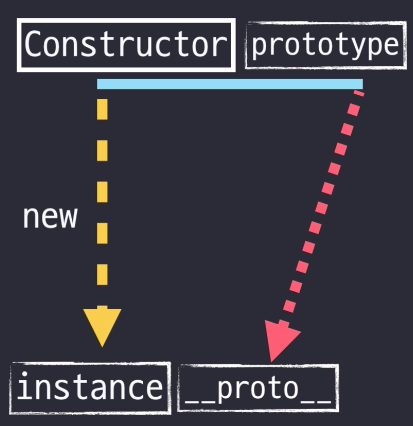

# [6장] 프로토타입

- 자바스크립트는 프로토타입 기반 언어
- 클래스 기반 언어에서는 상속을 사용하지만 프로토타입 기반 언어에서는 어떤 객체를 원형으로 삼고 이를 복제함으로써 상속과 비슷한 효과를 얻는다.

> ❓**원형(prototype)** <br>
> 모든 객체는 다른 객체로부터 직접적으로 생성된다. 이 때 생성된 객체는 원본이 되는 객체를 원형이라고 부른다.

## 1. 프로토타입의 개념 이해



- 어떤 생성자 함수를 new 연산자와 함께 호출하면
- constructor에서 정의된 내용을 바탕으로 새로운 인스턴스가 생성된다.
- 이때 instance에는 `__proto__` 라는 프로퍼티가 자동으로 부여되는데
- 이 프로퍼티는 constructor의 prototype이라는 프로퍼티를 참조한다.

```jsx
var suzi = new Person('Suzi')
suzi.__proto__.getName() // undefined
```

`__proto__`를 통해 호출할 때 메서드의 `this`가 `suzi` 객체를 가리키지 않기 때문에 undefined가 뜬다.

```jsx
// 직접 호출하는 경우
console.log(suzi.getName()) // "Suzi"

// __proto__를 통한 호출
console.log(suzi.__proto__.getName.call(suzi)) // "Suzi"
```

**📍`__proto__`와 `prototype` 관계**

- 인스턴스 객체의 `__proto__` 속성은 생성자 함수의 `prototype` 속성을 참조한다.
- 인스턴스는 생성자 함수의 프로토타입에 정의된 메서드와 속성을 사용할 수 있다.

```jsx
function Person(name) {
  this.name = name
}

// 프로토타입에 메서드 정의
Person.prototype.getName = function () {
  return this.name
}

// 새로운 인스턴스 생성
var suzi = new Person('Suzi')

// __proto__는 생성자 함수의 prototype을 참조
console.log(suzi.__proto__ === Person.prototype) // true

// 프로토타입 메서드 호출
console.log(suzi.getName()) // "Suzi"
```

### ✨constructor 프로퍼티

- 생성자 함수의 프로퍼티인 prototype 객체 내부에는 constructor라는 프로퍼티가 있다.
- 이 프로퍼티는 원래의 생성자 함수(자기 자신)를 참조한다.
- constructor는 읽기 전용 속성이 부여된 예외적인 경우(기본형 리터럴 변수 - number, string, boolean)을 제외하고는 값을 바꿀 수 있다.

```jsx
// 생성자 함수 정의
function Person(name) {
  this.name = name
}

// 생성자 함수의 프로토타입에 메서드 추가
Person.prototype.sayHello = function () {
  console.log(`Hello, my name is ${this.name}`)
}

// 생성자 함수의 prototype 객체의 constructor 프로퍼티 확인
console.log(Person.prototype.constructor === Person) // true

// 새로운 객체 인스턴스 생성
var john = new Person('John')

// 생성된 객체의 constructor 프로퍼티를 통해 생성자 함수 확인
console.log(john.constructor === Person) // true

// 생성된 객체의 메서드 호출
john.sayHello() // "Hello, my name is John"
```

**📍다양한 constructor 접근 방법**

```jsx
// 생성자 함수 정의
function Person(name) {
  this.name = name
}

// 생성자 함수의 prototype에 메서드 추가
Person.prototype.sayHello = function () {
  console.log(`Hello, my name is ${this.name}`)
}

// 생성자 함수의 prototype 객체의 constructor 프로퍼티 확인 방법

// 1. 직접 접근
console.log(Person.prototype.constructor === Person) // true

// 2. 인스턴스에서 접근
var john = new Person('John')
console.log(john.constructor === Person) // true

// 3. Object.getPrototypeOf 사용
console.log(Object.getPrototypeOf(john).constructor === Person) // true

// 4. instanceof 연산자 사용
console.log(john instanceof Person) // true

// 5. constructor 속성 직접 확인
console.log(john.constructor === john.__proto__.constructor) // true
```

## 2. 프로토타입 체인

**📍메서드 오버라이드**

인스턴스가 동일한 이름의 프로퍼티나 메서드를 가지게 되면 메소드 오버라이드가 일어난다.

메서드 위에 메서드를 덮어씌웠다는 표현 → 원본을 제거하고 다른 대상으로 교체하는 것이 아니라 원본이 그대로 있는 상태에서 다른 대상을 그 위에 얹는 것.

```jsx
// 생성자 함수 정의
let Person = function (name) {
  this.name = name // 생성자 함수로 객체를 초기화할 때 name 속성을 설정
}

// 생성자 함수의 prototype에 메서드 추가
Person.prototype.getName = function () {
  return this.name // getName 메서드는 객체의 name 속성 값을 반환
}

// 인스턴스 생성 및 메서드 오버라이드
// Person 생성자를 이용하여 새로운 인스턴스 iu를 생성하고 '지금'을 인자로 넘긴다.
let iu = new Person('지금')
iu.getName = function () {
  return '바로 ' + this.name
}

// 오버라이드된 메서드 호출
console.log(iu.getName())
```

**📍프로토타입 체인**

- 객체는 자신의 프로토타입(부모 객체)을 가리키는 숨겨진 링크인 `__proto__`를 가진다.
- 이 링크를 따라가면 최종적으로 `null`에 도달할 때까지 연결된 체인을 따라 부모 객체의 속성 및 메서드에 접근할 수 있다.

> **💡프로토타입 체인**:  어떤 데이터의 `__proto__` 프로퍼티 내부에 다시 `__proto__` 프로퍼티가 연쇄적으로 이어진 것
>
> **💡프로토타입 체이닝** : 프로토타입 체인을 따라가며 검색하는 것

```jsx
let arr = [1, 2]

Array.prototype.toString.call(arr) // "1,2"

Object.prototype.toString.call(arr) // "[object Array]"

arr.toString() // "1,2"

arr.toString = function () {
  return this.join('_')
}

arr.toString() // "1_2"
```

- `arr.toString()`을 호출할 때, JavaScript 엔진은 먼저 `arr` 객체에서 `toString` 메서드를 찾는다. 만약 찾지 못하면, `arr.__proto__` 즉, `Array.prototype`에서 찾고, 그 다음 `Array.prototype.__proto__` 즉, `Object.prototype`에서 찾는다.
- 이러한 프로토타입 체이닝을 통해 `toString` 메서드가 결국 `Object.prototype.toString` 메서드로부터 상속된 것임을 확인할 수 있다.

**📍객체 전용 메서드의 예외사항**

- 어떤 생성자 함수이든 prototype은 반드시 객체이기 때문에 Object.prototype이 언제나 프로토타입 체인의 최상단에 존재한다.
- 객체에서만 사용할 메서드는 다른 여느 데이터 타입처럼 프로토타입 객체 안에 정의할 수 없다.

```jsx
Object.prototype.getEntries = function () {
  let res = []
  for (let prop in this) {
    if (this.hasOwnProperty(prop)) {
      res.push([prop, this[prop]])
    }
  }
  return res
}
let data = [
  ['object', { a: 1, b: 2, c: 3 }], //[["a",1], ["b",2],["c",3]]
  ['number', 345], // []
  ['string', 'abc'], //[["0","a"], ["1","b"], ["2","c"]]
  ['boolean', false], //[]
  ['func', function () {}], //[]
  ['array', [1, 2, 3]],
  // [["0", 1], ["1", 2], ["2", 3]]
]
data.forEach(function (datum) {
  console.log(datum[1].getEntries())
})
```

`Object.prototype.getEntries` 메서드를 모든 데이터 타입에 대해 일관되게 동작하도록 구현했기 때문에 문제가 발생한다. JavaScript의 특성상 모든 데이터 타입은 객체처럼 행동할 수 있으며, `Object.prototype`이 모든 객체의 프로토타입 체인 상단에 있기 때문에, 거의 모든 데이터 타입에서 `getEntries` 메서드에 접근할 수 있다.

**객체 이외의 데이터 타입에서의 동작**

- 숫자(`number`), 문자열(`string`), 불리언(`boolean`), 함수(`function`) 등은 객체가 아니므로 `__proto__` 링크를 통해 프로토타입 체인을 따라갈 수 없다.
- 하지만 JavaScript는 이들 데이터 타입에 대해 객체처럼 동작할 수 있는 방법을 제공한다.
  예) 원시 값(숫자, 문자열, 불리언)은 각각 `Number`, `String`, `Boolean`과 같은 래퍼 객체로 자동 변환될 수 있다.
- 따라서 `getEntries` 메서드가 배열이 아닌 데이터 타입에 대해 호출될 때 예상치 못한 동작이 발생할 수 있다.
  예) 숫자 `345`의 경우, 래퍼 객체 `Number`에 프로퍼티가 없으므로 빈 배열을 반환하는 것이 일반적이다.

**📍다중 프로토타입 체인**

- 자바스크립트의 기본 내장 데이터 타입들은 모두 프로토타입 체인이 1단계(객체)이거나 2단계(나머지)로 끝나는 경우만 있었지만 사용자가 새롭게 만드는 경우에는 그 이상도 얼마든지 가능하다.
- 대각선의 `__proto__` 를 연결해나가기만 하면 무한대로 체인 관계를 이어나갈 수 있다.

```jsx
let Grade = function () {
  let args = Array.prototype.slice.call(arguments) // 인자들을 배열로 변환
  for (let i = 0; i < args.length; i++) {
    this[i] = args[i] // Grade 객체의 속성으로 인자들을 할당
  }
  this.length = args.length // Grade 객체의 length 속성 설정
}

// Grade 객체 생성
let g = new Grade(100, 80)
```
